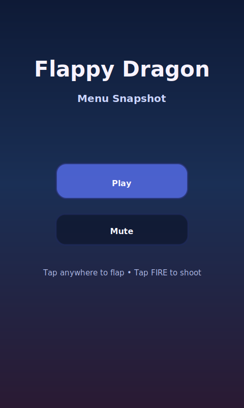
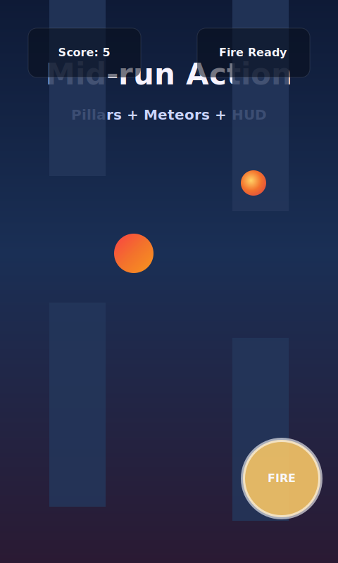
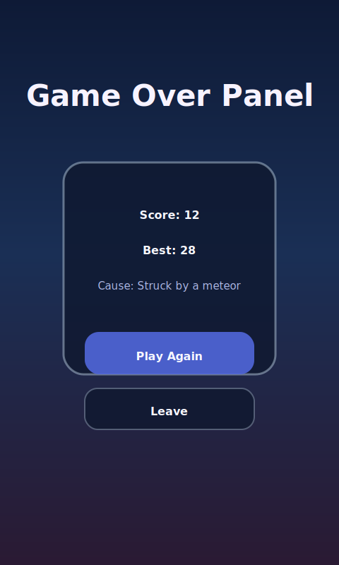

# Flappy Dragon

A portrait-oriented HTML5 canvas game inspired by Flappy Bird. Guide a tenacious dragon through castle pillars, blast incoming meteors with fireballs, and chase high scores that persist between runs.

## Table of Contents
- [Project Status](#project-status)
- [Features](#features)
- [Showcase](#showcase)
- [Tech Stack](#tech-stack)
- [Repository Layout](#repository-layout)
- [Getting Started](#getting-started)
- [Controls](#controls)
- [Game States](#game-states)
- [Core Systems Specification](#core-systems-specification)
- [Weather & Power-Ups](#weather--power-ups)
- [Work Plan](#work-plan)
- [Testing Checklist](#testing-checklist)
- [Release Checklist](#release-checklist)
- [Changelog](#changelog)
- [Contributing](#contributing)
- [License](#license)

## Project Status
- Core gameplay loop implemented: dragon physics, pillars, meteors, fireballs, scoring, and best-score persistence.
- Phase 3 UX pass complete with start/menu buttons, pause overlays, mute toggle (persisted), and on-screen FIRE control.
- Phase 4 audio & polish complete: Web Audio cues, parallax skyline, particle effects, and retuned difficulty curves.
- Dynamic weather system and elemental power-up loop implemented (shards, buffs, and shield charges).

## Features
- Fixed virtual resolution (480x800) with responsive letterboxing.
- Scene manager coordinating Boot, Menu, Play, Pause, and Game Over flows.
- Dragon flight physics with flap impulse, gravity, collision detection, and tilt feedback.
- Pillar spawning, meteor threats, and fireball projectiles with cooldown-limited shooting and bonus scoring.
- Touch-first enhancements: on-screen FIRE button, tap-to-flap, and HUD indicators mirroring keyboard controls.
- Persistent best-score and mute settings via `localStorage`.
- Layered parallax backdrop with animated starfield and responsive ground strip.
- Dynamic weather cycles and biome tints that gently adjust spawn cadence and visibility.
- Lightweight Web Audio soundboard with mute persistence, first-input unlock, and cues for toggles, pickups, and shields.
- Elemental power-ups fueled by ember shards (Flame Surge, Aegis Shield, Wind Glyph).
- Particle bursts for crashes, meteor hits, and score pops tied to HUD feedback.

## Showcase

| Menu snapshot | Mid-run action | Game over |
| --- | --- | --- |
|  |  |  |


> These visuals are stylised mocks stored in `docs/media/`. Replace them with real captures before shipping v1.0.0.

## Tech Stack

- HTML5 canvas + vanilla JavaScript (ES module style IIFE).
- CSS for responsive portrait layout and presentation polish.
- No external runtime dependencies or build tooling required.

## Repository Layout
```
.
|-- docs/
|   |-- media/                # Release collateral (screenshots, GIFs)
|   `-- development-plan.md   # Detailed multi-phase delivery roadmap
|-- index.html                # Minimal shell that mounts the game canvas
|-- styles.css                # Layout and presentation styling
|-- game.js                   # Main game loop, scene manager, input plumbing
|-- agents.md                 # Team roles and responsibilities
|-- CHANGELOG.md              # Version history and release notes
`-- readme.md                 # Project overview, setup, and roadmap summary
```

## Getting Started
### Prerequisites
- Node.js is **not** required. Any static file server will do (Python 3 is handy).
- Modern desktop or mobile browser with canvas and ES2015 support.

### Setup
1. Clone the repository:
   ```bash
   git clone https://github.com/fusioncomputing/flappydragongame.git
   cd flappydragongame
   ```
2. Serve the files locally (choose one):
   - Python 3: `python -m http.server 8000`
   - VS Code Live Server or any static host
3. Open `http://localhost:8000` in your browser and load `index.html`.

## Controls
- Space or Up Arrow: flap
- F: fireball (with cooldown)
- P: pause or resume
- Escape: leave to menu
- Mouse or touch tap: flap (tap to hold FIRE button for touch shooting)
- M: toggle mute
- First tap or key press unlocks audio cues (browser requirement).
- Meteor kills grant ember shards; collect power-up orbs by flying through them.

## Game States

- **BOOT**: preload assets, transition to Menu when ready.
- **MENU**: title screen with Play and Mute buttons.
- **PLAY**: active gameplay loop and scoring.
- **PAUSE**: dimmed overlay, resume/leave buttons, mute shortcut.
- **GAME_OVER**: display score, personal best, cause of failure, Play Again and Leave buttons.

## Core Systems Specification
Key numbers that shape the moment-to-moment feel:
- Dragon: x = 120, radius 22, gravity 1800, flap impulse vy = -520, max fall speed 900.
- Pillars: width 90, scroll speed eases from 184 to 252 as difficulty rises, gaps contract from 218px toward a 140px floor, spacing starts at 260-340px and tightens late run.
- Meteors: radius 14, base speed 240-360 with subtle drift, spawn cadence eases from 2.4s down to 0.85s.
- Fireballs: speed 540, cooldown 0.28s, lifetime 2.0s, radius 10 (Flame Surge increases radius & pierce).
- Power-ups: ember shards drop from meteors (1 each), orb spawns every 6 shards, effects include Flame Surge (piercing fireballs), Aegis Shield (one-hit protection), and Wind Glyph (reduced gravity/scroll speed).
- Weather cycle: clear, tempest, aurora, and ember gale states adjust pillar speed (+/-8%), meteor cadence, and gravity; transitions every ~35-55s.
- Ground collision at y = 720; top bound collision ends the run.

Collision fairness:
- Dragon uses a forward-offset circle check.
- Pillars rely on axis-aligned rectangles with a small fairness inset.
- Meteors and fireballs use circle overlaps.
- Aegis Shield power-up absorbs a lethal hit before consuming a charge.

## Weather & Power-Ups
### Weather Cycle
- Clear, Tempest, Aurora Drift, and Ember Gale fronts ease in over ~35-55 seconds.
- Each state blends backdrop gradients, star visibility, fog overlays, and difficulty multipliers.
- Modifiers tweak pillar scroll speed, meteor spawn cadence, and gravity so runs feel dynamic but fair.

### Elemental Power-Ups
- Meteors drop ember shards; collecting six spawns an orb that tracks the scroll speed with gentle bobbing.
- Flame Surge widens fireballs and grants pierce charges for sustained meteor clears.
- Wind Glyph slims gravity and scroll speed while stretching meteor intervals for recovery windows.
- Aegis Shield adds a shield charge that absorbs one lethal hit with dedicated particles and audio cues.
- Pickups and shield pops ship with bespoke sound effects that respect mute persistence.
## Work Plan
High-level roadmap (full detail in `docs/development-plan.md`):
1. **Phase 0 - Foundations**: Repo setup, tooling decisions, local server workflow (complete).
2. **Phase 1 - Core Scaffolding**: Canvas bootstrap, scene manager, input plumbing (complete).
3. **Phase 2 - Gameplay Systems**: Core loop, combat, and balancing passes (complete; difficulty curve tuned in Phase 4).
4. **Phase 3 - UX and Controls**: Start/pause/game-over overlays, mute persistence, mobile controls (complete).
5. **Phase 4 - Audio and Polish**: Web Audio cues, parallax backdrop, particle FX, and difficulty retune (complete).
6. **Phase 5 - QA and Release**: Regression checklist, performance passes, documentation finalization (pending).
7. **Post-launch Backlog**: Candidate gameplay expansions outlined in `docs/feature-backlog.md`.

Progress updates are committed to `main` after every milestone to keep trunk deployment-ready.

## Testing Checklist
Manual QA should cover:
- Single tap/press produces one flap impulse.
- Dragon hitbox vs pillar edges behaves fairly.
- Fire cooldown prevents spamming; meteors destroyed by fireballs consistently.
- On-screen FIRE button responds to taps/holds and respects cooldown.
- Score increments once per pillar pair; meteor bonus applies on confirmed hits.
- Difficulty ramps with tighter gaps and faster spawns later in runs.
- Audio cues unlock on first input and respect mute toggles across scenes.
- Particle bursts appear for meteor hits, crashes, and score pops without stalling the frame rate.
- Parallax backdrop and ground scroll smoothly on long sessions and window resizes.
- Canvas resizes without distortion; letterboxing stays stable.
- Pause/resume flow preserves state without resetting.
- Mute and best score persist via `localStorage`.
- Weather transitions (clear/tempest/aurora/gale) cycle smoothly and adjust difficulty modifiers.
- Ember shards drop on meteor kills; orbs spawn at the correct threshold and despawn off-screen if missed.
- Flame Surge expands fireballs and allows piercing hits while active; Wind Glyph lowers gravity/scroll speed for its duration.
- Aegis Shield charges prevent one death and update HUD counts and particles.

## Release Checklist
- Capture fresh menu, mid-run, and game-over screenshots and update `docs/media/`.
- Record a short gameplay GIF (5-8 seconds) covering flap, meteor hit, and scoring, then replace the placeholder asset.
- Run through the Testing Checklist on desktop and mobile portrait viewports.
- Update `CHANGELOG.md` and tag `v1.0.0` once QA passes.

Progress tracker: see `docs/release-checklist.md` for current status and QA notes.

## Changelog

See `CHANGELOG.md` for a human-curated release history. The 1.0.0 entry captures the Phase 4 polish milestone.

## Contributing

Trunk-based workflow on `main`. Push small, reviewed increments with descriptive commits. Coordinate via issues or discussions for larger features.

## License
TBD.


